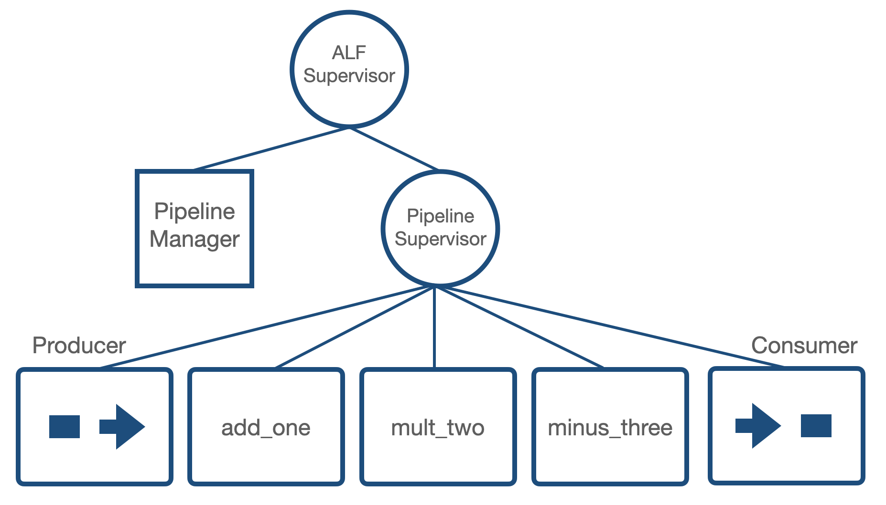
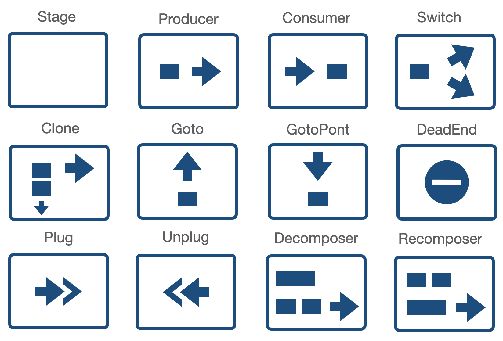

# ALF

[](https://hex.pm/packages/alf)

## Flow-based Application Layer Framework

#### ALF is a set of flow-control abstractions built on top Elixir GenStage which allows writing programs following the [Flow-Based Programming (FBP)](https://en.wikipedia.org/wiki/Flow-based_programming) approach.

#### ALF is a framework for your application layer, it provides a simple and expressive way of presenting the logic as sequential processing of "information packets" (IPs) (or, simply, messages or events), and thus brings high design-, coding-, and run-time observability.

#### ALF is NOT a general-purpose "language", so implementing a complex domain logic with it might be questionable (although it is possible).

#### ALF is a successor of the [Flowex](https://github.com/antonmi/flowex) project. Check it's [README](https://github.com/antonmi/flowex#readme) to get the general idea. ALF adds conditional branching, packet cloning, goto statement, decomposer/recomposer and other functionalities. Therefore, one can create application trees (graphs) of arbitrary complexity.

### Something to read and watch

[Flow-Based Programming with Elixir and ALF](https://www.youtube.com/watch?v=2XrYd1W5GLo) - Code BEAM 2022

[ALF — Flow-based Application Layer Framework](https://anton-mishchuk.medium.com/alf-flow-based-application-layer-framework-8072ae9b0b6b) - post

[Where is Application Layer](https://medium.com/p/6c65a459543a) - post

[ALF - Flow-based Application Layer Framework](https://www.youtube.com/watch?v=nh4TzOavknM) - Sydney Elixir Meetup

### Broadway, Flow?

What's the difference between ALF and [Broadway](https://github.com/dashbitco/broadway) or [Flow](https://github.com/dashbitco/flow)?

The short answer is: Broadway and Flow are tools for processing streams of data while ALF is a framework for writing general business logic.

The three libraries are build on top of the GenStage library, so they are similar in a sense that there are GenStages in which you can put your own code. But the focus is completely different.

Flow focuses on "computations on collections, similar to the Enum and Stream modules", it's a quite low-level tool for processing large collections of data.

Broadway is about "data ingestion and data processing pipelines". The main abstraction are "data processors", there are lots of adapters to different data sources and so on.

ALF is NOT about data-processing (although you can easily do it with ALF). It's about a FBP-way to build your application layer logic.

## Installation

Just add `:alf` as dependency to your `mix.exs` file.

```elixir
  defp deps do
    [
      {:alf, "~> 0.8"}
    ]
  end
```

ALF starts its own supervisor (`ALF.DynamicSupervisor`). All the pipelines and managers are started under the supervisor

## Important notice!

In the version "0.8" the interface was changed significantly.

And now all the interactions go through the pipeline module itself.

```elixir
# start and stop
MyPipeline.start() # instead of ALF.Manager.start(MyPipeline)
MyPipeline.stop()  # instead of ALF.Manager.stop(MyPipeline) 

# send events
MyPipeline.call(event, opts \\ []) # new
MyPipeline.stream(enumerable, opts \\ []) # instead of ALF.Manager.stream_to(enumerable, MyPipeline)
MyPipeline.cast(event, opts \\ []) # new
```

## Quick start

Read a couple of sections of [Flowex README](https://github.com/antonmi/flowex#readme) to get the basic idea of how your code is put to GenStages.

### Define your pipeline

A pipeline is a list of components defined in the `@components` module variable.

```elixir
defmodule ThePipeline do
  use ALF.DSL

  @components [
    stage(:add_one),
    stage(:mult_by_two),
    stage(:minus_three)
  ]

  def add_one(event, _opts), do: event + 1
  def mult_by_two(event, _opts), do: event * 2
  def minus_three(event, _opts), do: event - 3
end
```

### Start the pipeline

```elixir
:ok = ThePipeline.start()
```

This starts a manager (GenServer) with the `ThePipeline` name. The manager starts all the components and puts them under another supervision tree.



### Use the pipeline

There are several ways you can run your pipeline.
There are `call/2`, `cast/2` and `stream/2` functions.

`call/2` calls the pipeline and blocks the caller process until the result is returned.

```elixir
ThePipeline.call(1) # returns 1
ThePipeline.call(2, return_ip: true) # it returns %ALP.IP{} struct
```

`cast/2` sends event to the pipeline and returns the IP reference immediately.

```elixir
ThePipeline.cast(1) # returns reference like #Reference<0.3669068923.1709703170.126245>
```

One can actually receive the result of the `cast/2` back with `send_result: true` option.

```elixir
ref = ThePipeline.cast(1, send_result: true)
receive do
  {^ref, %ALF.IP{event: event}} -> 
    event
end
```

`stream/2` is a bit different.
It receives a stream or `Enumerable.t` and returns another stream where results will be streamed.

```elixir
inputs = [1,2,3]
output_stream = ThePipeline.stream(inputs)
Enum.to_list(output_stream) # it returns [1, 3, 5]
```

### Parallel processing of several streams

The ALF pipeline can handle arbitrary amount of events streams in parallel.
For example:

```elixir
 stream1 = ThePipeline.stream(0..9)
 stream2 = ThePipeline.stream(10..19)
 stream3 = ThePipeline.stream(20..29)

 [result1, result2, result3] =
   [stream1, stream2, stream3]
   |> Enum.map(&Task.async(fn -> Enum.to_list(&1) end))
   |> Task.await_many()
```

Check [test/examples](https://github.com/antonmi/ALF/tree/main/test/examples) folder for more examples

### Synchronous evaluation
There are cases when you don't need the underlying gen_stage infrastructure (a separate process for each component).
E.g. in tests, or if you debug a wierd error.
There is a possibility to run a pipeline synchronously, when everything is run in one process.
Just pass `sync: true` option to the `start` function.

```elixir
:ok = ThePipeline.start(sync: true)
```

There are only `call/2` and `stream/2` functions available in this mode, no `cast/2`.

### The main idea behind ALF DSL

User's code that is evaluated inside components must be defined either as a 2-arity function or as a module with the `call/2` function.
The name of the function/module goes as a first argument in DSL. And the name also become the component's name.

```elixir
  stage(:my_fun)
  # or
  stage(MyComponent)
```

where `my_fun` is
```elixir
def my_fun(event, opts) do
  #logic is here
  new_event
end
```

and `MyComponent` is

```elixir
defmodule MyComponent do
  # optional
  def init(opts), do: %{opts | foo: :bar}

  def call(event, opts) do
    # logic is here
    new_event
  end
end
```

One can specify a custom name:

```elixir
  stage(:my_fun, name: :my_custom_name)
```

Most of the components accept the `opts` argument, the options will be passed as a second argument to the corresponding function.

```elixir
  stage(MyComponent, opts: [foo: :bar])
```

Check `@dsl_options` in [lib/components](https://github.com/antonmi/ALF/tree/main/lib/components) for available options.

## Components overview



### Producer and Consumer

Nothing special to know, these are internal components that put at the beginning and at the end of your pipeline.

### Stage

Stage is the main component where one puts a piece of application logic. It might be a simple 2-arity function or a module with `call/2` function:

```elixir
  stage(:my_fun, opts: %{foo: bar})
  # or
  stage(MyComponent, opts: %{})
```

where `MyComponent` is

```elixir
defmodule MyComponent do
  # optional
  def init(opts), do: %{opts | foo: :bar}

  def call(event, opts) do
    # logic is here
    new_datum
  end
end
```
There is the `:count` option that allows running several copies of a stage.

```elixir
  stage(:my_fun, count: 5)
```
Use it for controlling parallelism.

### Switch

Switch allows to forward IP (information packets) to different branches:

```elixir
switch(:my_switch_function,
        branches: %{
          part1: [stage(:foo)],
          part2: [stage(:bar)]
        },
        opts: [foo: :bar]
      )
# or with module
switch(MySwitchModule, ...)
```

The `my_switch_function` function is 2-arity function that must return the key of the branch:

```elixir
def my_switch_function(event, opts) do
  if event == opts[:foo], do: :part1, else: :part2
end

# or

defmodule MySwitchModule do
  # optional
  def init(opts), do: %{opts | baz: :qux}

  def call(event, opts) do
    if event == opts[:foo], do: :part1, else: :part2
  end
end
```

### Clone

Clones an IP, useful for running aspects.

```elixir
clone(:my_clone, to: [stage(:foo), dead_end(:dead_end)])
```

### Goto

Send packet to a given `goto_point`

```elixir
goto(:my_goto_function, to: :my_goto_point, opts: [foo: :bar])
# or
goto(MyGotoModule, to: :my_goto_point, opts: [foo: :bar])
```

The `function` function is 2-arity function that must return `true` of `false`

```elixir
def my_goto_function(event, opts) do
  event == opts[:foo]
end
```

### GotoPoint

The `Goto` component companion

```elixir
goto_point(:goto_point)
```

### DeadEnd

Event won't propagate further. It's used alongside with the `Clone` component to avoid duplicate IPs in output

```elixir
dead_end(:dead_end)
```

### Plug and Unplug

Plug and Unplug are used for transforming events before and after reusable parts of a pipeline.
The components can not be used directly and are generated automatically when one use `plug_with` macro. See below.

### Decomposer and Recomposer

These components transform IPs. Decomposer creates several IPs based on one input IP. Recomposer does the opposite - creates a single IP based on a list of previously received IPs.
Decomposer must implement a 2-arity function (or a module with the `call` function) that return either a list of new events:

```elixir
def decomposer_function(event, _opts) do
  [event + 1, event + 2, event + 3]
end
```

or the the `{list(event), event}` tuple:

```elixir
def decomposer_function(event, _opts) do
  {[event + 1, event + 2, event + 3], event * 100}
end
```

In the first case the initial IP will disappear and a list of new IPs will be created based on athe returned events.
In the second case, the `event` of original IP will be replaced by the event from the second value in the tuple.

Recomposer is a bit more tricky. It is a 3-arity function (module with the `call` function). The first argument is incoming `event`, the second one is a list of previously accumulated events, and the last one is `opts`
The function must return `event`, `{event, list(event)}` or `:continue` atom.
For example:

```elixir
  def recomposer_function(event, prev_events, _opts) do
    sum = Enum.reduce(prev_events, 0, &(&1 + &2)) + event

    case sum > 5 do
      true -> sum
      false -> :continue
    end
  end
```

The component will return one event (`sum`) if the sum of previously received events is more than 5. If no, the events are just store in the component.
`{event, list(event)}` tuple allows to return a event and also specify what to store till another call.

```elixir
def recomposer_function_tuple(event, prev_events, _opts) do
  sum = Enum.reduce(prev_events, 0, &(&1 + &2)) + event

  case sum > 5 do
    true -> {sum, [hd(prev_events)]}
    false -> :continue
  end
end
```

In that case, the sum will be returned and the first `event` from `prev_events` will be stored.
See the [telegram_test.exs](https://github.com/antonmi/ALF/tree/main/test/examples/telegram_test.exs) example which solves the famous "Telegram Problem".

## Components / Pipeline reusing

### `stages_from` macro

One can easily include components from another pipeline:

```elixir
defmodule ReusablePipeline do
  use ALF.DSL
  @components [
    stage(:foo),
    stage(:bar)
  ]
end

defmodule ThePipeline do
  use ALF.DSL
  @components stages_from(ReusablePipeline) ++ [stage(:baz)]
end
```

### `plug_with` macro

Use the macro if you include other components that expect different type/format/structure of input events.

```elixir
defmodule ThePipeline do
  use ALF.DSL

  @components [
                plug_with(AdapterModuleBaz, do: [stage(:foo), stage(:bar)])
              ] ++
                plug_with(AdapterModuleForReusablePipeline) do
                  stages_from(ReusablePipeline)
                end

end
```

`plug_with` adds `Plug` component before the components in the block and `Unplug` at the end.
The first argument is an "adapter" module which must implement the `plug/2` and `unplug/3` functions

```elixir
def AdapterModuleBaz do
  def init(opts), do: opts # optional

  def plug(event, _opts) do
    # The function is called inside the `Plug` component.
    # `event` will be put on the "AdapterModuleBaz" until IP has reached the "unplug" component.
    # The function must return `new_event` with the structure expected by the following component
    new_event
  end

  def unplug(event, prev_event, _opts) do
    # here one can access previous "event" in `prev_event`
    # transform the event back for the following components.
    new_event
  end
end
```

## Diagrams

The amazing thing with the FBP approach is that one can easily visualize the application logic.
Below there are several ALF-diagrams for the examples in [test/examples](https://github.com/antonmi/ALF/tree/main/test/examples).

### Bubble sort


### Bubble sort with Switch


### Tic-tac-toe
See [tictactoe repo](https://github.com/antonmi/tictactoe)


